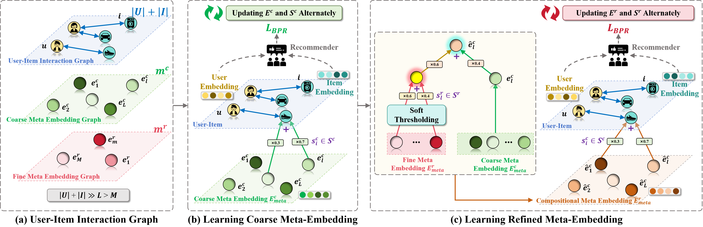
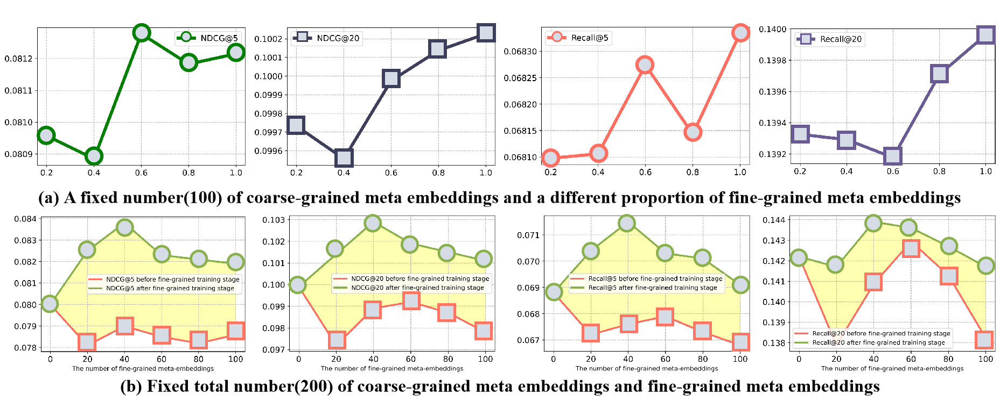

# C2F-MetaEmbed
### [Paper]() | [BibTex](https://github.com/htyjers/C2F-MetaEmbed?tab=readme-ov-file#-citation)

This repository is the official code for the paper "Coarse-to-Fine Lightweight Meta-Embedding for ID-Based Recommendation" by Yang Wang (<a href="mailto:yangwang@hfut.edu.cn">Email</a>), Haipeng Liu (<a href="mailto:hpliu_hfut@hotmail.com">Email</a>), Zeqian Yi, Biao Qian, and Meng Wang (corresponding author).

## 📚 Table of Contents

- [📖 Introduction](https://github.com/htyjers/C2F-MetaEmbed?tab=readme-ov-file#-introduction)
- [🌟 C2F-MetaEmbed](https://github.com/htyjers/C2F-MetaEmbed?tab=readme-ov-file#-c2f-metaembed-)
- [📊 Experimental Results](https://github.com/htyjers/C2F-MetaEmbed?tab=readme-ov-file#-experimental-results)
- [🔖 Citation](https://github.com/htyjers/C2F-MetaEmbed?tab=readme-ov-file#-citation)


<details open>
<summary><h1>📖 Introduction</h1></summary>
The state-of-the-art recommendation systems have shifted the attention to efficient recommendation, e.g., on-device recommendation, under memory constraints. To this end, the existing methods either focused on the lightweight embeddings for both users and items, or involved on-device systems enjoying the compact embeddings to enhance reusability and reduces space complexity. However, they focus solely on the coarse granularity of embedding,  while overlook the fine-grained semantic nuances, to adversarially downgrade the efficacy of meta-embeddings in capturing the intricate  relationship over both user and item, consequently resulting into the suboptimal recommendations. In this paper, we aim to study how the meta-embedding can efficiently learn varied grained semantics, together with how the fine-grained meta-embedding can strengthen the representation of coarse-grained meta-embedding. To answer these questions, we develop a novel graph neural networks (GNNs) based recommender where each user and item serves as the node, linked directly to coarse-grained virtual nodes and indirectly to fine-grained virtual nodes, ensuring different grained semantic learning, while disclosing: 1) In contrast to coarse-grained semantics, fine-grained semantics are well captured through sparse meta-embeddings, which adaptively 2)  balance the embedding uniqueness and memory constraint. Additionally,  the initialization method come up upon SparsePCA, along with a soft thresholding activation function to render the sparseness of the meta-embeddings. We propose a weight bridging update strategy that focuses on matching each coarse-grained meta-embedding with several fine-grained meta-embeddings based on the users/items' semantics. Extensive experiments substantiate our method's superiority over existing baselines.
	
##


<p align="center">Figure 1. Illustration of the proposed pipeline.</p>

##
	
In summary, our contributions are summarized below:
- We propose a novel GNN-based model for multi-grained semantics of meta-embeddings, the hierarchical and selective connectivity ensures that the model learns wide-ranging semantic information at the coarse level, while also focusing on granular, personalized features at the fine level.
- An initialization approach is adopted by optimizing the coarse meta-embeddings and SparsePCA to selectively seed the embedding codebook, which preserves the sparsity and maintains associative relationships between users and items.
- A soft thresholding technique is developed to dynamically adjust the sparsity levels during training, while offering a more adaptable and robust model that responds to the varied intricacies of the data.
- Lastly, we develop an innovative weight to bridge update strategy that dynamically aligns coarse-grained meta-embeddings with multiple fine-grained meta-embeddings based on semantic relevance, ensuring efficacy of the recommendation.

</details>


<details open>
<summary><h1>🌟 C2F-MetaEmbed </h1></summary>

## 1. Dependencies
* OS: Ubuntu 20.04.6
* nvidia :
	- cuda: 12.3
	- cudnn: 8.5.0
* python3
* pytorch >= 1.13.0
* Python packages:
  ```bash
  pip install -r requirements.txt
  ```

## 2. Dataset 
Train and test sets of Gowalla, Yelp2020 are located in [here](https://pan.baidu.com/s/1TUeNaT6_wioDBWwhIswgfg?pwd=f3vp).

## 3. The Coarse-Grained Training Stage

### Implementation Details
* We followed the [LEGCF](https://github.com/xurong-liang/LEGCF) framework to set most of the hyperparameters during the coarse training stage, with **bold font** indicating the parameters with different values.
* More details are provided in the later part of the quantitative analysis.

| **Hyperparameter**               | **Gowalla**  | **Yelp2020** |
|----------------------------------|--------------|--------------|
| **Sign_ft**                      | **0**       | **0**        |
| **Clusters (c)**                 | **300**     | **300**      |
| **Evaluate Frequency**           | **5**       | **5**        |
| Assignment Update Frequency (m)  | every epoch  | every epoch  |
| GCN Layers                       | 3            | 4            |
| L2 Penalty Factor                | 5            | 5            |
| Learning Rate (lr)               | 1e-3         | 1e-3         |
| Composition Coarse Embeddings per Entity (t) | 2       | 2            |
| Initial Anchor Weight (w\*)      | 0.5          | 0.6          |
| ...      |...          | ...          | ...             |

### Run the following command

```python
Python3 engine.py --dataset_name gowalla --res_prepath your path1 --sign_ft 0 --device_id 0
```

## 4. The Fine-Grained Training Stage

### Implementation Details
* **Bold font** indicating the parameters that differ from those used in the coarse stage.
* More details are provided in the later part of the quantitative analysis.
  
| **Hyperparameter**               | **Gowalla**  | **Yelp2020** |
|----------------------------------|--------------|--------------|
| **Sign_ft**                                        | **1**        | **1**        |
| **Clusters (c)**                                   | **100**      | **100**      |
| **Evaluate Frequency**                             | **5**        | **5**        |
| **Learning Rate (lr)**                             | **3e-3**     | **3e-3**     |
| **Composition Fine Embeddings per Entity (ft)**     | **4**        | **4**        |
| **Initial Anchor Weight (w\*)**                    | **0.5**      | **0.5**      |
| **Components of SparsePCA**                         | **80**       | **80**       |
| **Soft Thresholding**                               | **1**        | **1**        |
| **Weight parameter**                                | **0.2**      | **0.2**      |
| Assignment Update Frequency (m)  | every epoch  | every epoch  |
| GCN Layers                       | 3            | 4            |
| L2 Penalty Factor                | 5            | 5            |
| ...      |...          | ...          |


### Run the following command

```python
Python3 engine.py --dataset_name gowalla --res_prepath your path2 --sign_ft 1 --init_path_ft  your path1 --device_id 0
```

## 5. Acknowledgments
This implementation is based on / inspired by:
* [https://github.com/xurong-liang/LEGCF](https://github.com/xurong-liang/LEGCF) (LEGCF)
  
</details>

<details open>
<summary><h1>📊 Experimental Results</h1></summary>

## Quantitative analysis
| **Log**               | **Gowalla**  | **Yelp2020** |
|----------------------------------|--------------|--------------|
| **Coarse-Grained Training Stage**        |[Hyperparameter&Results](https://github.com/htyjers/C2F-MetaEmbed/tree/main/result/gowalla/Coarse-grained%20Training%20Stage)|[Hyperparameter&Results](https://github.com/htyjers/C2F-MetaEmbed/tree/main/result/yelp2020/Coarse-grained%20Training%20Stage)|
| **Fine-Grained Training Stage**        |[Hyperparameter&Results](https://github.com/htyjers/C2F-MetaEmbed/tree/main/result/gowalla/Fine-grained%20Training%20Stage)|[Hyperparameter&Results](https://github.com/htyjers/C2F-MetaEmbed/tree/main/result/yelp2020/Fine-grained%20Training%20Stage)|

## Ablation study about space complexity

</details>


<details open>
<summary><h1>🔖 Citation</h1></summary>

</details>
